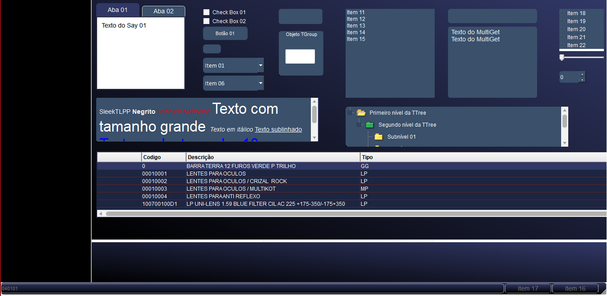

# SleekTLPP

SleekTLPP e uma classe em Tlpp que contém os componentes do Prothues que são personalizaveis com QTCss.


## 🛠 Technologies used


[
](https://tdn.totvs.com.br/)

## Features

- Personalização de componentes utilizando CSS.
- Padronzação no estilo dos componentes.
- Manipulação do estilo aplicado via parâmetros.

## Exemplo de uso da classe SleekTLPP

#### Método para utilizar com o componente TButton

```advpl
 oBtn := TButton():New( aCordenadas[1] + 030, aCordenadas[2] + 125, "Button" , oPanelItens, { || }, 50, 15, , , .F., .T., .F., ,.F., , , .F. )
 oBtn:SetCss( SleekTLPP():TButtonQCss() )
```


## 🔗 Referências Utilizadas


[
](https://tdn.totvs.com.br/)

[
](https://www.youtube.com/watch?v=PPRJuU0xdx4&embedsreferringeuri=https%3A%2F%2Fwww.blogadvpl.com%2F&sourcevepath=MjM4NTE)

[
](https://terminaldeinformacao.com/2024/06/30/criando-um-editor-atraves-da-tsimpleeditor-maratona-advpl-e-tl-509/#google_vignette)

## Componentes estilizados



